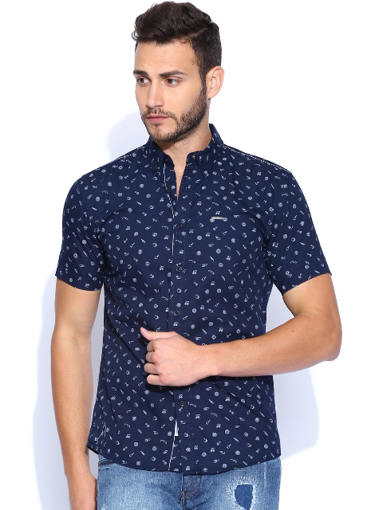

# Foreground Segmentation for Images with Uniform Background

This module was developed as part of [marooner](https://github.com/amberm291/marooner-final). This module extarcts the background from an image with a uniform background, by converting the entire background to a RGB value of `(0,0,0)`. Below is an example. 

		
`Input Image`		`Output Image`

