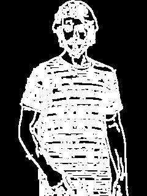
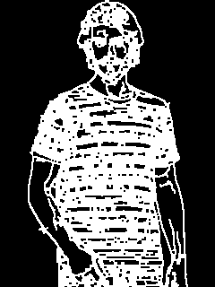
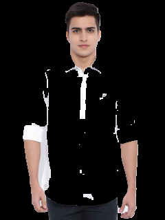

## Foreground Segmentation for Images with Uniform Background

This module was developed as part of [marooner](https://github.com/amberm291/marooner-final). This module extracts the background from an image with a uniform background, by converting the entire background to a RGB value of `(0,0,0)`. For an input image like this 


it gives output as


### Implementation

This module was implemented in 4 major steps

- **Canny Edge Detection**: A Canny edge detector is applied on the input image to convert the entire background to a grayscale value of 0. The upper and lower threshold of the canny edge detector can be varied according to different use cases. For ours, we found 10 to 20 to be a good lower threshold and 120 to 150 to be a good upper one. Canny detection when applied to the input image shown above gives the following output:


- **Dilation of Edge Image**: Once, the edge image is formed from the edge detector, we dilate it with a kernel size of `(3x3)`. This is done to ensure that small gaps in the edges gets closed. A close inspection of the canny image above will reveal small gaps in the outermost edges. Image dilation helps in closing these gaps. the output of image dilation is:



- **Erosion of Edge Image**: Applying a dilation kernel of size `(3x3)` leaves the edges with a thickness of 3 pixels wide. Although this not a problem in most use cases, in ours this was a problem. So we eroded the output of dilation with a kernel of size (2x2). The output of erosion is:



- **Breadth-First-Search in image to get final output**: Once, the image is eroded, we simply run a breadth first search from the corners of the image setting a value of `(0,0,0)` in the pixels of the original image, where corresponding pixels in the eroded image are 0. The stopping criteria for BFS is set to whenever it discovers a non-zero pixel. The output of this step is the one shown above as the final output.

### Usage

The function `segmentImage` in `foreground.py` can be used to extract foregrounds. The only parameter `segmentImage` requires is the path of the input image. The output of the function is the extracted image in numpy array representation.

```bash
>>> from foreground import segmentImage
>>> img_path = "/some_path/input.jpg"
>>> output_img = segmentImage(img_path)    #output_img is the extracted image in numpy array representation.
```

For an input image of size `(320x240)`, `segmentImage` takes about 3.6 seconds to generate the output.

### Limitations

If the boundary between foreground and background is not discernable enough, or the colors of foreground and background are very similar, this module fails spectacularly. Below are some outputs for such cases,

	

The inputs for these images are in the `images` folder. Needless to say, this module won't work on images which don't have uniform backgrounds like the ones in the `images` folder.

### Note

Some other inputs are in the `images` folder. The script `resize.py` can be used to resize all images of `images` folder to `(320,240)`. This image size can be changed in the script easily.

This work is free. You can redistribute it and/or modify it under the terms of the Do Whatever You Want To Public License.


